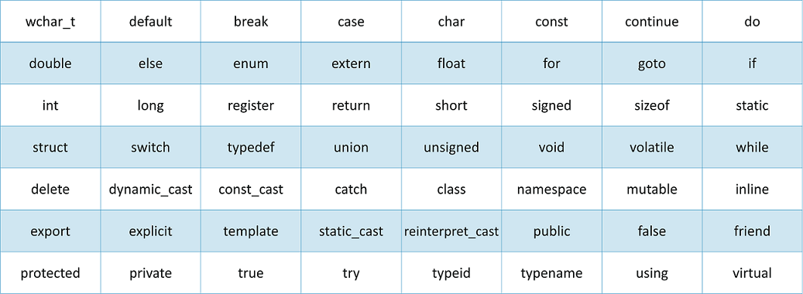
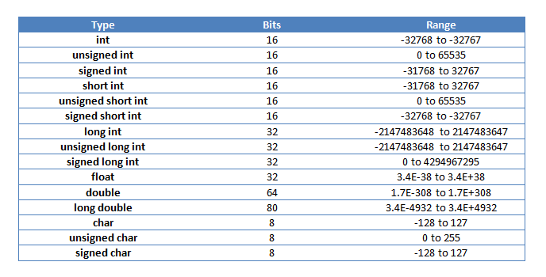

### :fire: Basic Input/Output In C++

- C++ comes with libraries which helps us in performing intput/output are commonly knowns as **streams**.
- **Input Stream:** Direction of flow of bytes takes place from input device (for example keyboard) to the main memory.
- **Output Stream:** Direction of flow of bytes takes place from main memory to the output device (for example Display).

### :fire: List Of Resserved Keywords In C++
- This is a list of keywords reserved in C++
- Since they are used by the language itself, these keywords are not available for re-definition or overloading.
- In short, you cannot create a variable with these names.

### :fire: Data Type Size And Range In C++

